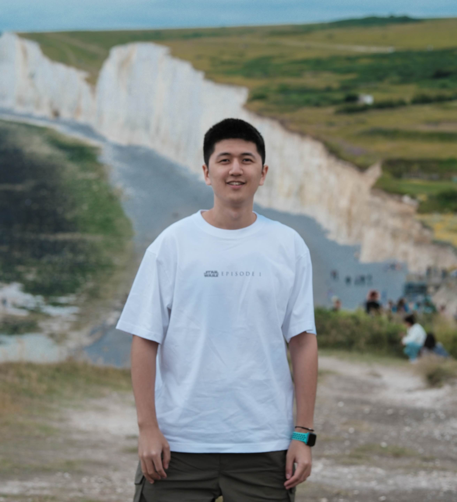
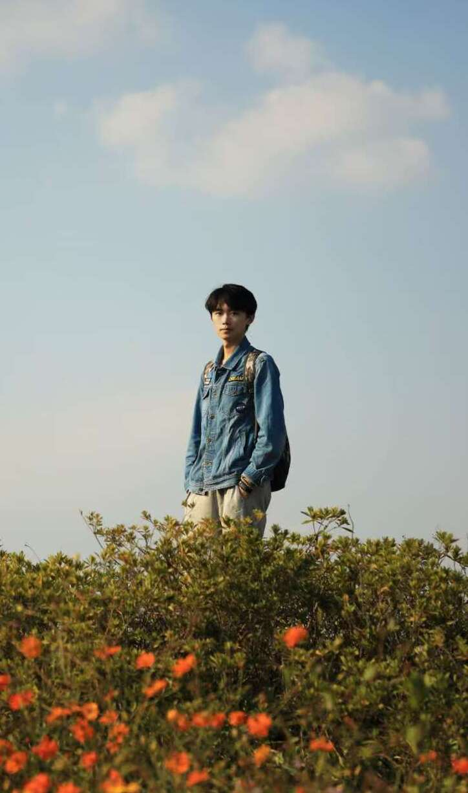
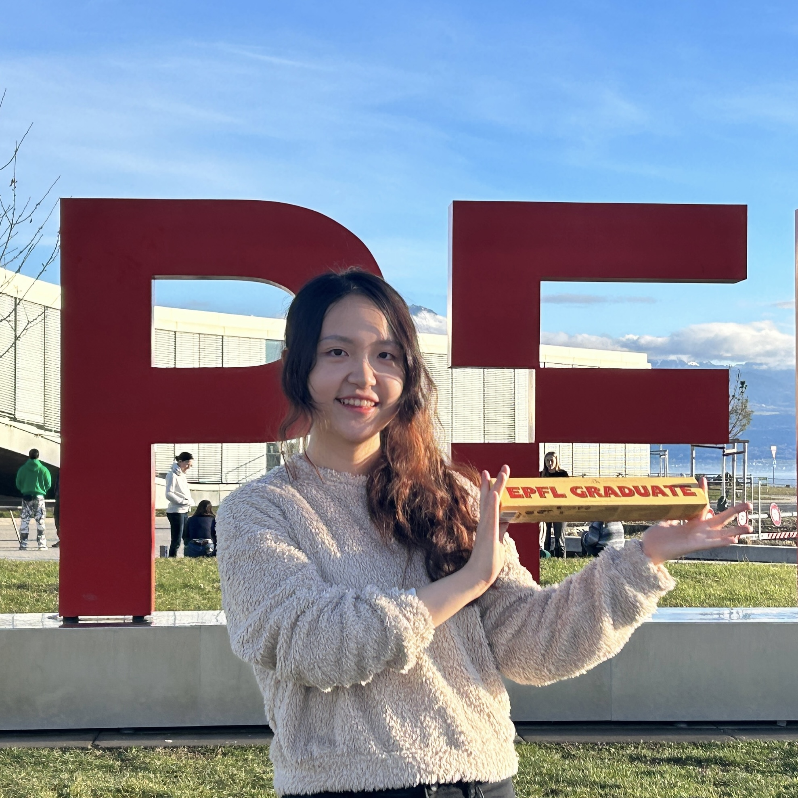
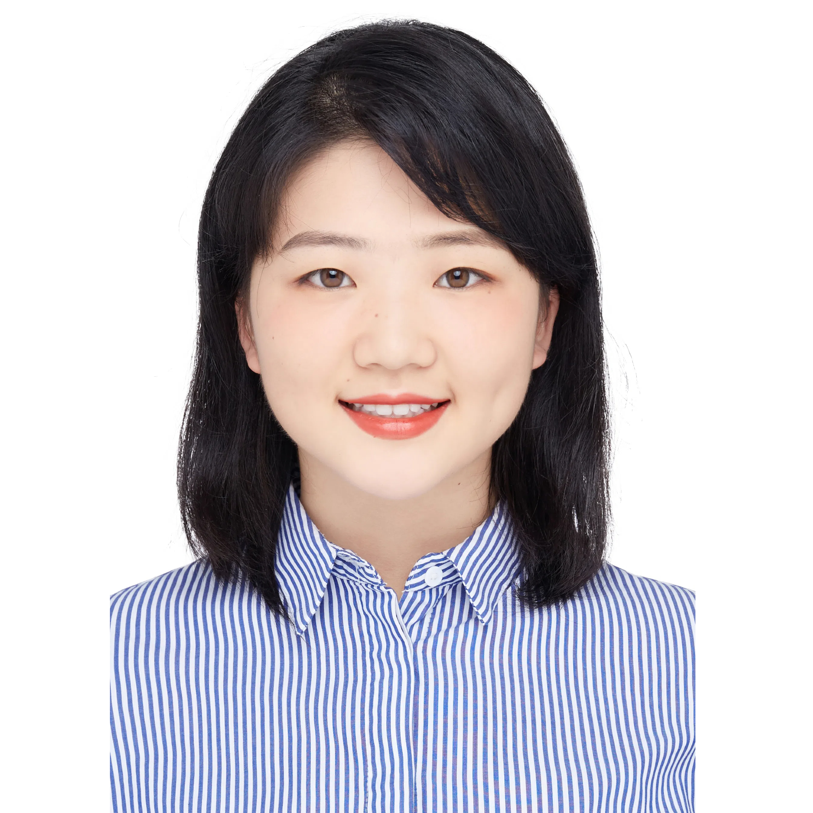
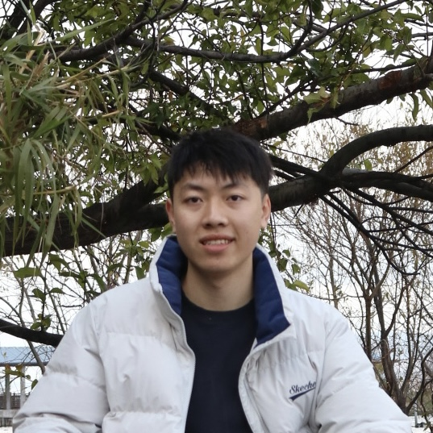

  

    

      I am actively looking for highly motivated students to join my group (<strong>Earliest round for Ph.D./M.Phil: 2026 Spring/Fall</strong>). See <a href="https://xmouyang.github.io/opening/">openings</a> for more details. Please <a href="mailto:xmouyang@cse.ust.hk">email me</a> your CV and transcript if you are interested.
    

    

      I lead the <strong>M</strong>obile, <strong>I</strong>ntelligent, and <strong>N</strong>etworked <strong>Sys</strong>tem (<strong>MINSys</strong>) Group @ HKUST CSE. Here is our <a href="https://github.com/HKUST-MINSys-Lab">Group GitHub page</a>. I am fortunate to work with the following members:
    

  

<h3>Postgraduate Students</h3>

  

    
    <h4><a href="https://hrx20000209.github.io/">Runxi Huang</a></h4>
    
Ph.D. student, MS NTU, BS BeiHang U.

    
<em>(2024 Fall – )</em>

  

  

    
    <h4>Yizhen Wang</h4>
    
Ph.D. student, BS Zhejiang U.

    
Hong Kong PhD Fellowship

    
<em>(2025 Fall – )</em>

  

  

    
    <h4><a href="https://doriszhang.cafe">Liyu Zhang</a></h4>
    
Ph.D. student, BS HKUST

    
<em>(2025 Fall – )</em>

  

  

    
    <h4><a href="https://yejialiu.github.io/">Yejia Liu</a></h4>
    
MPhil. student, BS Shanghai Jiaotong U.

    
<em>(2025 Fall – )</em>

  

  

    
    <h4>Haoxian Liu</h4>
    
MPhil. student, BS SUSTech

    
<em>(2025 Fall – )</em>

  

<h3>Undergraduate Students</h3>
<ul class="undergrad-list">
  <li>Hengle Jiang, Undergraduate Student from SUSTech, 2024 Fall –</li>
  <li>Larry Kwun Ho Liu, Undergraduate Student from HKUST, 2025 Spring –</li>
  <li>Yuchen Wang, Undergraduate Student from HKUST, 2025 Spring –</li>
  <li>Lanxuan Hong, Undergraduate Student from HKUST, 2025 Spring –</li>
  <li>Hongyu Chen, Undergraduate Student from HKUST, 2025 Summer –</li>
  <li>Jiajun Fu, Undergraduate Student from USTC, 2025 Summer –</li>
</ul>

<h3>Co-advising Students</h3>
<ul class="coadvising-list">
  <li>Yolanda Lau, Ph.D. Student at UCL (serve as the secondary supervisor), 2024 Spring –</li>
</ul>

---

