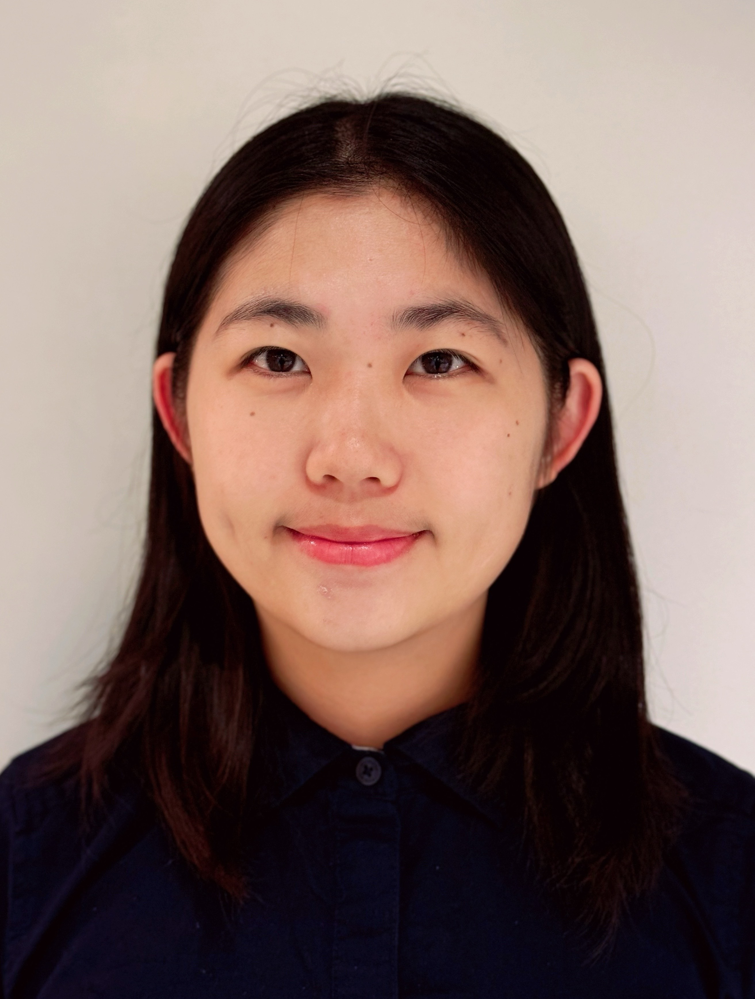

  

  
I am actively looking for highly motivated students to join my group (**Earliest round for Ph.D./M.Phil: 2026 Spring/Fall**). See [openings](https://xmouyang.github.io/opening/) for more details. Please <a href="mailto:xmouyang@cse.ust.hk">email me</a> your CV and transcript if you are interested in.

I lead the **M**obile, **I**ntelligent, and **N**etworked **Sys**tem (**MINSys**) Group @ HKUST CSE. Here is our [Group GitHub page](https://github.com/HKUST-MINSys-Lab). I am fortunate to work with the following members:

  

  

    
    <h4>Dr. Xiaomin Ouyang</h4>
  

- **Postgraduate Students**

  

    
    <h4><a href="https://hrx20000209.github.io/">Runxi Huang</a></h4>
    
Ph.D. student, MS NTU, BS BeiHang U.

    
<em>(2024 Fall – )</em>

  

  

    
    <h4>Yizhen Wang</h4>
    
Ph.D. student, BS Zhejiang U., HKPFS

    
<em>(2025 Fall – )</em>

  

  

    
    <h4><a href="https://doriszhang.cafe">Liyu Zhang</a></h4>
    
Ph.D. student, BS HKUST

    
<em>(2025 Fall – )</em>

  

  

    
    <h4><a href="https://yejialiu.github.io//YejiaLiupages.github.io/">Yejia Liu</a></h4>
    
MPhil. student, BS Shanghai Jiaotong U.

    
<em>(2025 Fall – )</em>

  

  

    
    <h4>Haoxian Liu</h4>
    
MPhil. student, BS SUSTech

    
<em>(2025 Fall – )</em>

  

- **Undergraduate Students**
    - Hengle Jiang, Undergraduate Student from SUSTech, 2024 Fall –  
    - Larry Kwun Ho Liu, Undergraduate Student from HKUST, 2025 Spring –  
    - Yuchen Wang, Undergraduate Student from HKUST, 2025 Spring –  
    - Lanxuan Hong, Undergraduate Student from HKUST, 2025 Spring –  
    - Hongyu Chen, Undergraduate Student from HKUST, 2025 Summer –  
    - Jiajun Fu, Undergraduate Student from USTC, 2025 Summer –  

- **Co-advising Students**
    - Yolanda Lau, Ph.D. Student at UCL (serve as the secondary supervisor), 2024 Spring –  

---

